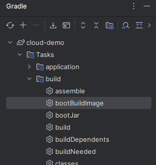

# 12-Factor App Demo

This project demonstrates 4 key principles of the [12-Factor App methodology](https://12factor.net/) using Spring Boot, Docker and GitHub Actions.

## Submitted by

- Yarden Perets
- Daniel Jerbi
- Ben Aharoni
- Gal Deri


## 1. Codebase
> **One codebase tracked in revision control, many deploys.**

The application source is tracked in this single Git repository. We use **GitHub Actions** to ensure that every push to the `main` branch results in a consistent, automated build process. No environment-specific code exists within the repository.

- **Source Control:** Git & GitHub

## 2. Dependencies
> **Explicitly declare and isolate dependencies.**

All dependencies are explicitly declared in the `build.gradle` file. This ensures that the project does not rely on the implicit existence of any system-wide packages or libraries. By using Gradle, we guarantee that every build uses the exact same versions of the required libraries, providing a reproducible build environment.

## 3. Config
> **Store config in the environment.**

All configuration that varies between deployments (such as database credentials, API keys, or resource handles) is stored in environment variables. We use a `config.env` file to manage these variables locally and in production. The application code contains no constants or hardcoded secrets, strictly following the requirement to keep config separate from code.

## 4. Build, Release, Run
> **Strictly separate build and run stages.**

The deployment lifecycle is divided into three mutually exclusive stages:

1.  **Build:** We use Spring's `bootBuildImage` gradle command to build a `native docker` of the spring application
    - Triggered by a push to `main`, **GitHub's Action Runner** calls the command in order to create a Docker image.
2.  **Release:** The resulting image is tagged with the `version` from `build.gradle` and pushed to the **GitHub Container Registry (GHCR)** 
    - a release is created with a `config.env` which is an `immutable artifact` ready for execution.
3.  **Run:** The application is launched in the execution environment by pulling the image and providing the `config.env` from the release, like this:
    ```bash
    # Pull the latest release
    docker pull ghcr.io/lordyorden/cloud-demo:latest
    
    # Run with environment-specific config
    docker run -p <port config> --env-file config.env ghcr.io/lordyorden/cloud-demo:latest
    ```

### Versioning
The version number/image name is set by `imageName` in `build.gradle`
```groovy
def name = project.hasProperty('group') ? project.property('group').toString() : "lordyorden"

imageName = "ghcr.io/${name}/${project.name.toLowerCase()}:${version}"
```
- to change the name just change the following:
    ```groovy
    group = 'lordyorden' //set it to your own github if you fork this repo
    version = '1.0'
    description = 'cloud-demo'
    ```
  or just change `imageName` directly

### Try it locally
you can just run: 
```bash
./gradlew bootBuildImage
```
- or click `bootBuildImage` in the gradle window of `intelij`


---


### Prerequisites
- JDK 25
- Docker
- Gradle 8.10+